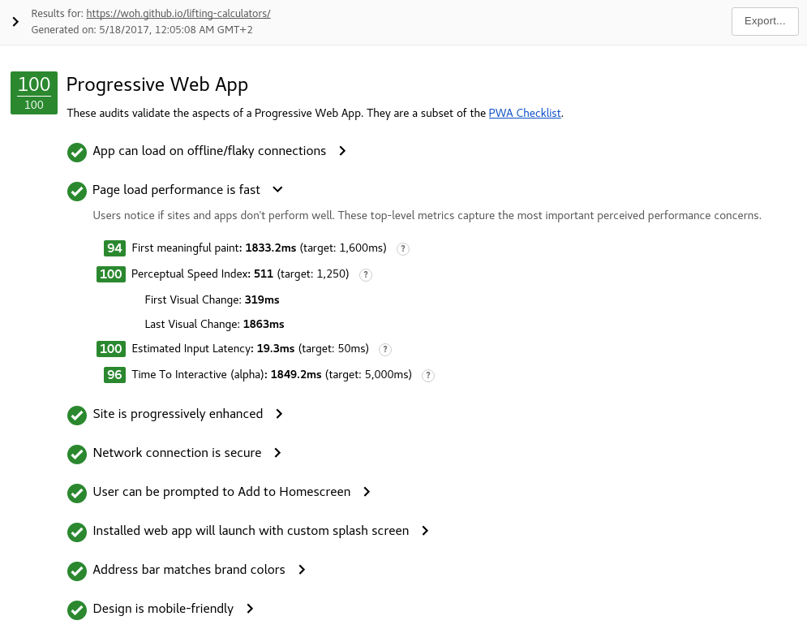

# [Lifting Calculator](https://woh.github.io/lifting-calculators)

## Features:
- Calculate one rep / n rep max given 
- Calculate warmup sets given target weight / reps
- ServiceWorker for offline support
- WebApp Manifest for convenient access after adding it to homescreen

## Technical Details

This project was generated with [Angular CLI](https://github.com/angular/angular-cli) version 1.0.3.

### Progressive Web App

### Development server

Run `ng serve` for a dev server. Navigate to `http://localhost:4200/`. The app will automatically reload if you change any of the source files.

### Build

Run `ng build` to build the project. The build artifacts will be stored in the `dist/` directory. Use the `-prod` flag for a production build.
Run `npm run gh-prepare` to generate the production build, ServiceWorker and Webapp Manifest inside the `dist/` directory.

### Further help

To get more help on the Angular CLI use `ng help` or go check out the [Angular CLI README](https://github.com/angular/angular-cli/blob/master/README.md).
